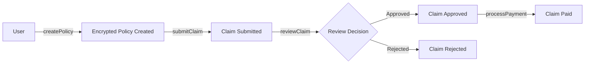

# Technical Documentation - Private Vehicle Insurance

## Architecture Overview

### Smart Contract Layer

```
┌─────────────────────────────────────────┐
│     PrivateVehicleInsurance.sol         │
│  - Policy Management (FHE)              │
│  - Claim Processing (FHE)               │
│  - Risk Assessment (FHE)                │
│  - Access Control                       │
└──────────────┬──────────────────────────┘
               │
               │ uses immutable reference
               ▼
┌─────────────────────────────────────────┐
│          PauserSet.sol                  │
│  - Multi-pauser Management              │
│  - Immutable Configuration              │
└─────────────────────────────────────────┘
```

## FHE Implementation Details

### Encryption Types Used

| Type | Purpose | Range | Use Case |
|------|---------|-------|----------|
| `euint32` | Personal data | 0 - 4,294,967,295 | Age, driving years, amounts |
| `euint64` | Large values | 0 - 2^64-1 | Future expansion |
| `ebool` | Boolean flags | true/false | Future conditions |

### FHE Operations

#### 1. Policy Creation with Encryption
```solidity
// User submits plaintext (client-side encrypted via fhevmjs)
euint32 encryptedAge = FHE.asEuint32(_age);
euint32 encryptedDrivingYears = FHE.asEuint32(_drivingYears);
euint32 encryptedVehicleValue = FHE.asEuint32(_vehicleValue);
euint32 encryptedPremium = FHE.asEuint32(_premium);

// Automatic re-randomization for sIND-CPAD security
// No manual input proof needed!
```

#### 2. Access Control List (ACL)
```solidity
// Allow contract itself
FHE.allowThis(encryptedAge);

// Allow user to decrypt their own data
FHE.allow(encryptedAge, msg.sender);

// Allow insurance company
FHE.allow(encryptedAge, insuranceCompany);
```

#### 3. Risk Score Calculation (Homomorphic)
```solidity
// Computation on encrypted data
euint32 ageWeight = FHE.mul(policy.encryptedAge, FHE.asEuint32(3));
euint32 experienceBonus = FHE.mul(policy.encryptedDrivingYears, FHE.asEuint32(2));
euint32 valueWeight = FHE.mul(policy.encryptedVehicleValue, FHE.asEuint32(1));

// Complex arithmetic
euint32 riskBase = FHE.add(ageWeight, valueWeight);
euint32 totalRisk = FHE.sub(riskBase, experienceBonus);
```

### Gateway Integration (Updated Pattern)

**BREAKING CHANGE**: New `is...` pattern replaces `check...`

#### Old Pattern (Deprecated)
```javascript
// ❌ DEPRECATED
try {
  await gatewayContract.checkPublicDecryptAllowed();
  // Proceed
} catch (error) {
  // Handle
}
```

#### New Pattern (Current)
```javascript
// ✅ CORRECT
const isAllowed = await gatewayContract.isPublicDecryptAllowed();
if (isAllowed) {
  // Proceed with decryption
} else {
  // Handle denied case
}
```

## Security Features

### 1. Fail-Closed Design
```solidity
modifier whenNotPaused() {
    require(!isPaused, "Contract is paused");
    _;
}

modifier onlyPolicyHolder(uint256 _policyId) {
    require(policies[_policyId].holderAddress == msg.sender, "Not policy holder");
    require(policies[_policyId].isActive, "Policy not active");
    _;
}
```

### 2. Input Validation (Before Encryption)
```solidity
require(_age >= 18 && _age <= 100, "Invalid age");
require(_drivingYears <= _age - 16, "Invalid driving years");
require(_vehicleValue > 0, "Vehicle value must be positive");
require(_premium > 0, "Premium must be positive");
```

### 3. PauserSet Mechanism
```solidity
// Immutable pauser addresses set at deployment
address public immutable pauserSetContract;

modifier onlyPauserSet() {
    require(msg.sender == pauserSetContract, "Not authorized pauser");
    _;
}
```

**Configuration Formula**:
```
NUM_PAUSERS = n_kms + n_copro

Where:
- n_kms = number of KMS nodes
- n_copro = number of coprocessors
```

### 4. Transaction Re-randomization
- **Automatic**: All transaction inputs are re-encrypted before FHE operations
- **Security**: Provides sIND-CPAD (indistinguishability under chosen plaintext attack with auxiliary inputs)
- **Impact**: Minimal gas cost increase, no code changes needed

## Contract Interactions

### Policy Lifecycle



### Claim Status Flow

```
Submitted (0) → UnderReview (1) → {Approved (2) | Rejected (3)}
                                          ↓
                                     Paid (4)
```

### Access Permissions Matrix

| Action | Policy Holder | Insurance Company | Authorized Reviewer | Other |
|--------|--------------|-------------------|---------------------|-------|
| Create Policy | ✅ | ✅ | ✅ | ✅ |
| Submit Claim | ✅ (own policy) | ❌ | ❌ | ❌ |
| Review Claim | ❌ | ✅ | ✅ | ❌ |
| Process Payment | ❌ | ✅ | ❌ | ❌ |
| View Claim Details | ✅ (own) | ✅ (all) | ✅ (all) | ❌ |
| Decrypt Policy Data | ✅ (own) | ✅ (all) | ❌ | ❌ |
| Authorize Reviewer | ❌ | ✅ | ❌ | ❌ |

## Frontend Integration

### Initialization
```typescript
import { initializeFhevm, createEncryptedPolicy } from './utils/fhevm';

// Initialize FHEVM
const instance = await initializeFhevm(provider, contractAddress);

// Create policy with automatic encryption
const receipt = await createEncryptedPolicy(
  contract,
  30,      // age
  10,      // drivingYears
  25000,   // vehicleValue
  1200     // premium
);
```

### Decryption Flow
```typescript
// 1. Generate EIP-712 signature
const signature = await generateReencryptSignature(
  signer,
  contractAddress,
  userAddress
);

// 2. Request decryption via gateway
const decrypted = await requestDecryption(
  encryptedData,
  signer,
  contractAddress
);
```

## Gas Optimization

### Contract Size
- **Target**: < 24KB
- **Tool**: hardhat-contract-sizer
- **Enabled**: Runs automatically on compile

### Gas Reporter
```bash
REPORT_GAS=true npm test
```

## Testing Strategy

### Test Categories

1. **Unit Tests** (`test/PrivateVehicleInsurance.test.ts`)
   - Policy creation validation
   - Claim submission logic
   - Access control enforcement
   - Edge cases and boundary conditions

2. **Integration Tests** (`test/PauserSet.test.ts`)
   - PauserSet deployment
   - Multi-pauser coordination
   - Pause/unpause mechanics

3. **FHE Operation Tests**
   - Encryption/decryption flows
   - Homomorphic operations
   - ACL permissions

### Test Coverage Goals
- **Line Coverage**: > 95%
- **Branch Coverage**: > 90%
- **Function Coverage**: 100%

## Deployment Checklist

### Pre-deployment
- [ ] Configure `.env` with correct network settings
- [ ] Set KMS_GENERATION_ADDRESS (not KMS_MANAGEMENT_ADDRESS)
- [ ] Configure NUM_PAUSERS and PAUSER_ADDRESS_0, PAUSER_ADDRESS_1, etc.
- [ ] Test on local Hardhat network
- [ ] Run full test suite
- [ ] Check contract size < 24KB
- [ ] Review gas costs

### Deployment Steps
```bash
# 1. Compile contracts
npm run compile

# 2. Run tests
npm test

# 3. Check contract size
npm run size

# 4. Deploy to Sepolia
npm run deploy:sepolia

# 5. Verify on Etherscan
npm run verify
```

### Post-deployment
- [ ] Verify contract on Etherscan
- [ ] Update frontend contract addresses
- [ ] Test policy creation on testnet
- [ ] Test claim submission
- [ ] Authorize initial reviewers
- [ ] Test pause/unpause functionality
- [ ] Update README with deployed addresses

## Troubleshooting

### Common Issues

#### 1. "Contract is paused"
**Solution**: Check if contract was paused. Call `isPaused()` and use authorized pauser to unpause.

#### 2. "Not authorized reviewer"
**Solution**: Ensure reviewer is authorized via `authorizeReviewer()` by insurance company.

#### 3. "Invalid age" or validation errors
**Solution**: Check input validation rules before encryption:
- Age: 18-100
- Driving years: ≤ age - 16
- Amounts: > 0

#### 4. Decryption fails
**Solution**:
1. Check ACL permissions with `FHE.allow()`
2. Verify user has correct signature
3. Ensure gateway is configured properly

#### 5. "Invalid PauserSet address"
**Solution**: Deploy PauserSet first, then pass its address to insurance contract constructor.

## Performance Benchmarks

### Estimated Gas Costs (Sepolia)

| Operation | Gas Used | USD (@ $2000 ETH, 20 gwei) |
|-----------|----------|----------------------------|
| Deploy PauserSet | ~300,000 | ~$12 |
| Deploy Insurance | ~3,500,000 | ~$140 |
| Create Policy | ~250,000 | ~$10 |
| Submit Claim | ~200,000 | ~$8 |
| Review Claim | ~150,000 | ~$6 |
| Process Payment | ~80,000 | ~$3.20 |

*Note: FHE operations incur higher gas costs than regular operations*

## Future Enhancements

### Planned Features
1. **Multi-sig Claims**: Require multiple reviewers for large claims
2. **Automated Underwriting**: AI-powered risk assessment on encrypted data
3. **Claim Appeal System**: Allow disputed claim reviews
4. **Premium Adjustment**: Dynamic premium calculation based on claim history
5. **Integration**: Link with real-world oracles for accident verification

### FHE Expansion
- Add `euint64` for larger claim amounts
- Implement `ebool` for complex conditional logic
- Use `ebytes` for encrypted documents

## References

- [Zama FHEVM Documentation](https://docs.zama.ai/fhevm)
- [fhevmjs Library](https://docs.zama.ai/fhevm/fhevmjs)
- [Gateway Integration Guide](https://docs.zama.ai/fhevm/gateway)
- [Hardhat Documentation](https://hardhat.org/docs)
- [Sepolia Testnet](https://sepolia.dev/)

---

**Last Updated**: 2025-10-23
**Contract Version**: v2.0.0
**FHEVM Version**: 0.5.0
